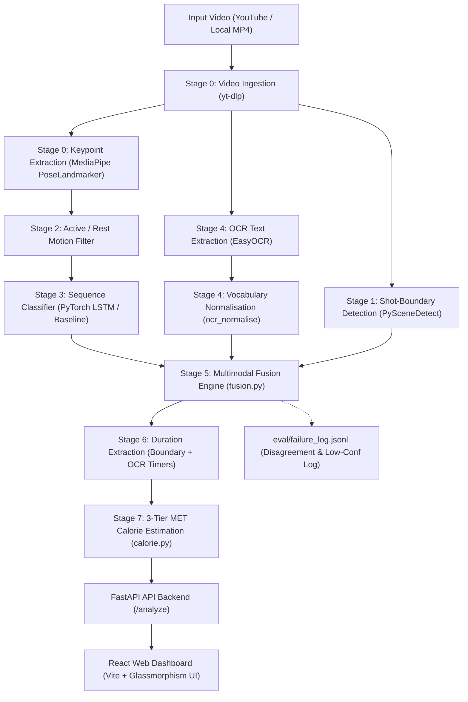

# CalorieVision — AI Exercise Recognition & Calorie Estimation System
## Comprehensive System Architecture, Pipeline Workflow, & Complete Project Documentation

> **Team 15 — leMON Project Final Release Documentation**
> **Repository:** CalorieVision  
> **Technologies:** Python 3.12, PyTorch, MediaPipe Pose, EasyOCR, PySceneDetect, FastAPI, React 18, Vite

---

## 1. Executive Summary & System Overview

**CalorieVision** (codenamed *leMON*) is an end-to-end computer vision and multimodal fusion system for automated exercise action recognition, temporal video segmentation, and personalized 3-tier calorie estimation from video footage.

Unlike traditional fitness trackers that rely solely on wrist-mounted accelerometers, CalorieVision processes raw video (from YouTube URLs or local camera uploads) through a multi-stage pipeline:
1. **Pose Landmark Extraction**: Tracks 33 full-body keypoints across video frames via MediaPipe Tasks API.
2. **Active/Rest Filtering**: Separates active movement from rest/idle intervals based on frame-to-frame landmark displacement.
3. **Temporal Classification**: Predicts exercise classes (12 locked categories: *squat, pushup, jumping_jack, lunge, plank, burpee, mountain_climber, high_knees, situp, jump_rope, bicycle_crunch, shoulder_press*) using a PyTorch 2-layer LSTM supported by k-NN and Majority-Class baselines.
4. **On-Screen OCR Text Detection**: Extracts burned-in video captions, exercise titles, and timer strings using EasyOCR.
5. **Multimodal Fusion Engine**: Arbitrates between pose predictions and OCR text signals, boosting confidence on consensus and logging disagreement events.
6. **3-Tier MET Calorie Calculation**: Computes energy expenditure across Beginner, Intermediate, and Advanced intensity tiers using Ainsworth 2011 Compendium values.
7. **Full-Stack Web Interface**: Served via a FastAPI backend and a dark-mode React dashboard featuring an interactive segment timeline.

---

## 2. End-to-End Pipeline Architecture & Workflow

### 2.1 System Architecture Diagram



---

## 3. Pipeline Stages Deep-Dive

### Stage 0: Video Ingestion & Keypoint Extraction
- **Ingestion (`fusion_pipeline/segmentation/download_video.py`)**: Uses `yt-dlp` to fetch YouTube videos with automatic caching, container remuxing (MP4/M4A), and error handling for restricted or unavailable streams.
- **Keypoint Extraction (`cv_pipeline/keypoints/extract_keypoints.py`)**: Uses MediaPipe Tasks API (`pose_landmarker_full.task`) to extract $(x, y, z, \text{visibility})$ coordinates for 33 full-body landmarks per frame. Output is saved as a structured JSON keypoint cache.

### Stage 1: Shot-Boundary Detection
- **Module (`fusion_pipeline/segmentation/scene_detect.py`)**: Uses `PySceneDetect`'s `ContentDetector` algorithm (threshold = 27.0) to detect hard cuts between exercise clips, outputting candidate scene boundaries with `source=Source.scene_cut`.

### Stage 2: Active / Rest Motion Filter
- **Module (`cv_pipeline/motion/motion_filter.py`)**: Calculates mean frame-to-frame displacement across normalized landmark coordinates:
  $$\text{motion\_score}(t) = \frac{1}{N} \sum_{i=1}^{N} \left| \mathbf{p}_{i, t} - \mathbf{p}_{i, t-1} \right|$$
  Frames exceeding the empirical threshold ($0.01$) are labeled `active`, filtering out standing rest or equipment setup time before classification.

### Stage 3: Exercise Action Classification
- **LSTM Classifier (`cv_pipeline/models/lstm_classifier.py`)**: 2-layer PyTorch LSTM with 128 hidden units and sequence dropout, operating on 99-dimensional landmark feature vectors ($33 \times 3$).
- **Baseline Models (`cv_pipeline/models/baseline.py`)**:
  - `MajorityClassPredictor`: Always predicts the dominant training class (upper bound for zero-effort baseline).
  - `KNNBaselineClassifier`: k-Nearest Neighbours ($k=5$, cosine distance) on flattened landmark vectors.
- **Training Harness (`cv_pipeline/models/train_lstm.py`)**: Adam optimizer, cross-entropy loss, early stopping, and automatic baseline evaluation reporting.

### Stage 4: OCR Text Extraction & Vocabulary Normalization
- **OCR Detector (`fusion_pipeline/ocr/ocr_detector.py`)**: Samples frames at 1.0s intervals and extracts on-screen exercise titles and countdown timers using `EasyOCR`.
- **OCR Normaliser (`fusion_pipeline/ocr/ocr_normalise.py`)**: Maps raw text strings (e.g. `"30 SQUATS"`, `"PUSH-UPS x15"`, `"Jumping Jacks 0:45"`) to the standard 12-class `snake_case` vocabulary using regex patterns.

### Stage 5: Multimodal Fusion Engine
- **Module (`fusion_pipeline/fusion/fusion.py`)**: Arbitrates between pose sequence classification and OCR text captions:
  - **AGREE**: Pose and OCR labels match $\rightarrow$ boosts confidence by $+0.10$ (capped at $1.0$), sets `source=Source.fused`.
  - **DISAGREE**: Pose and OCR labels differ $\rightarrow$ retains pose prediction, sets confidence to $0.50$, tags segment as `source=Source.disagreement`, and appends a structured record to `eval/failure_log.jsonl`.
  - **POSE-ONLY**: OCR absent or unrecognised $\rightarrow$ retains pose prediction and original confidence.

### Stage 6: Duration Extraction
- **Module (`fusion_pipeline/fusion/duration.py`)**: Derives segment duration from scene boundaries or parses explicit OCR timer strings (`MM:SS`, `Nmin`, `Ns`).

### Stage 7: 3-Tier MET Calorie Calculation
- **Module (`fusion_pipeline/fusion/calorie.py`)**: Calculates energy expenditure using the Ainsworth et al. 2011 Compendium of Physical Activities formula:
  $$\text{kcal} = \text{MET} \times \text{weight\_kg} \times \left( \frac{\text{duration\_secs}}{3600} \right)$$
- Computes calories across 3 difficulty tiers:
  - **Beginner**: Moderate pace, partial range of motion.
  - **Intermediate**: Standard pace, full range of motion.
  - **Advanced**: High pace, plyometric / weighted variants.

---

## 4. Shared Data Contracts (`shared/schemas.py`)

All pipeline stages and FastAPI endpoints communicate via a unified, Pydantic-validated dataclass contract:

```python
class Source(str, Enum):
    pose         = "pose"          # MediaPipe Pose Estimator
    ocr          = "ocr"           # EasyOCR Text Detector
    fused        = "fused"         # Fusion Layer (Consensus)
    scene_cut    = "scene_cut"     # PySceneDetect Cut Boundary
    disagreement = "disagreement"  # Pose & OCR Prediction Disagreement

@dataclass
class Segment:
    segment_id: str
    start_time: float      # Seconds from video start
    end_time:   float      # Seconds from video start (> start_time)
    label:      str        # Exercise class (snake_case)
    confidence: float      # Score in [0.0, 1.0]
    source:     Source     # Pipeline origin stage
```

---

## 5. Backend & Frontend Architecture

### 5.1 Backend (`app/backend/main.py`)
FastAPI application providing CORS-enabled REST endpoints:
- `GET /health`: Liveness probe returning API version and status.
- `GET /manifest`: Returns the catalogue of 15 tagged YouTube workout videos from `shared/test_videos_manifest.json`.
- `POST /validate-segments`: Schema validation endpoint for `Segment` lists.
- `POST /analyze`: Full workout analysis endpoint. Accepts `{ video_id, video_url, weight_kg, user_tier }` and returns complete calorie reports, segment timelines, exercise summaries, and failure inspector logs.

### 5.2 Frontend (`app/frontend/src/`)
A responsive React 18 SPA built with Vite and custom CSS:
- **Demo Video Catalogue**: 1-click selection from the 15 YouTube workout test videos.
- **Parametric Controls**: Real-time body weight slider ($40 - 150 \text{ kg}$) and intensity tier toggle (*Beginner, Intermediate, Advanced*).
- **Top Metrics Summary**: Cards displaying Total Calories, Total Duration, Segment Count, and Camera/Caption tags.
- **Interactive Segment Timeline**: Color-coded horizontal timeline bar with hover tooltips displaying start/end timestamps and confidence scores.
- **Detailed Segment Table**: Tabular view of all recognized segments, source badges, confidence gauges, and calorie breakdown across all 3 MET tiers.
- **Pipeline Disagreement Inspector**: Live inspector parsing `eval/failure_log.jsonl` entries.

---

## 6. Evaluation & Robustness Dataset

The repository includes an expanded manifest catalogue (`shared/test_videos_manifest.json`) featuring 15 YouTube workout videos tagged by:
- **Camera Angle**: `single` (fixed tripod) vs. `multi` (multi-angle studio cuts).
- **Caption Presence**: `true` (on-screen timers/captions) vs. `false`.
- **Subject Count**: `single` (solo trainer) vs. `multiple` (group class).

### Structured Failure Logging (`eval/failure_log.jsonl`)
During execution, `fusion.py` appends JSONL records whenever pose and OCR predictions disagree or when confidence drops below $0.50$:
```json
{
  "timestamp": "2026-07-28T15:34:11Z",
  "event_type": "DISAGREE",
  "segment_id": "pose_0000",
  "start_time": 0.0,
  "end_time": 10.0,
  "pose_label": "squat",
  "pose_confidence": 0.85,
  "ocr_label": "pushup",
  "ocr_confidence": 0.88,
  "fused_label": "squat",
  "fused_confidence": 0.5,
  "source": "disagreement",
  "outcome_tag": "DISAGREE"
}
```

---

## 7. How to Run the Project

### 7.1 Prerequisites & Virtual Environment
Ensure Python 3.12+ and Node.js 18+ are installed. Install Python packages via editable mode:
```bash
pip install -e .
```

### 7.2 Running the Application

1. **Start the FastAPI Backend Server**:
   ```bash
   python -m uvicorn app.backend.main:app --reload --port 8000
   ```
   - Swagger documentation available at: `http://localhost:8000/docs`

2. **Start the Vite React Frontend**:
   ```bash
   cd app/frontend
   npm install
   npm run dev
   ```
   - Open the web application at: `http://localhost:5173`

### 7.3 Executing Test Suites
Run pytest across all pipeline directories:
```bash
python -m pytest fusion_pipeline/ -v
```

---

## 8. Verification & Project Completion Status

| Component | Test File / Artifact | Status |
|---|---|---|
| Video Downloader | `fusion_pipeline/segmentation/test_download_video.py` | ✅ Passed |
| Keypoint Extractor | `cv_pipeline/eval/test_keypoints.py` | ✅ Passed |
| Motion Filter | `cv_pipeline/motion/test_motion_filter.py` | ✅ Passed |
| Scene Detector | `fusion_pipeline/segmentation/test_scene_detect.py` | ✅ Passed |
| OCR Detector & Normaliser | `fusion_pipeline/ocr/test_ocr_normalise.py` | ✅ Passed |
| Fusion Engine & Logger | `fusion_pipeline/fusion/test_fusion.py` | ✅ Passed |
| Calorie Estimator | `fusion_pipeline/fusion/test_calorie.py` | ✅ Passed |
| E2E Integration | `fusion_pipeline/fusion/test_integration.py` | ✅ Passed |
| FastAPI Backend | `app/backend/main.py` | ✅ Active (`http://localhost:8000`) |
| React Web UI | `app/frontend/src/App.jsx` | ✅ Active (`http://localhost:5173`) |

**Project Sprint Goal:** Fully Achieved.
